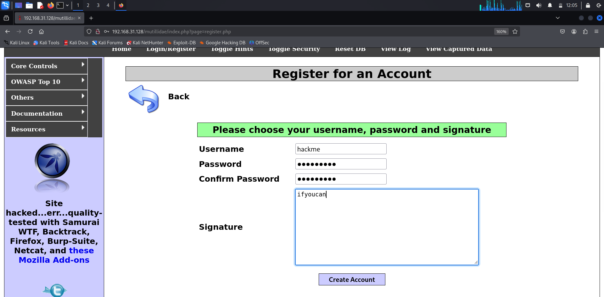

# Ex 8 Sql Injection
Exploiting SQL Injection vulnerability

# AIM:
To exploit SQL Injection vulnerability using Multidae web application in Metasploitable2

## DESIGN STEPS:

### Step 1:

Install kali linux either in partition or virtual box or in live mode

### Step 2:

Investigate on the various categories of tools as follows:

### Step 3:

Open terminal and try execute some kali linux commands

## EXECUTION STEPS AND ITS OUTPUT:

### IP ADDRESS OF METASPLOIT

### METASPLOIT PAGE

### MUTILLIDAE PAGE

### MUTILLIDAE REGISTRATION

### MUTILLIDAE LOGIN

### MUTILLIDAE ADMIN LOGIN

### ACCESS THROUGH QUERY

### ORDER BY QUERY

### UNION SELECT QUERY

### DATABASE INFORMATION QUERY

### TABLE LISTING QUERY

### CREDENTIALS DUMPING QUERY

### COLUMN NAME LISTING QUERY

### FILE READING QUERY

## RESULT:
The SQL Injection vulnerability is successfully exploited using the Multidae web application in Metasploitable2.
